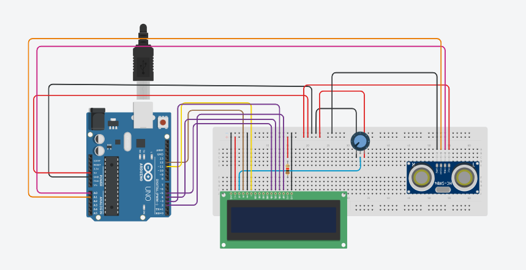
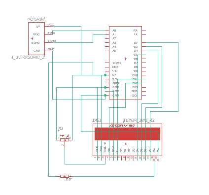
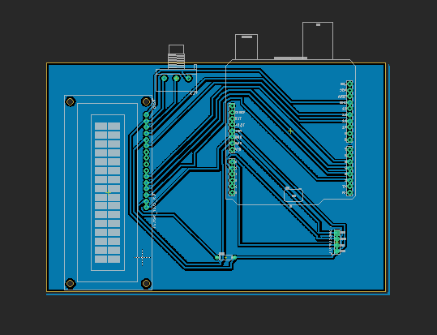

# Shield Arduino com LCD, Potenciômetro e Sensor Ultrassônico

## Descrição
Este projeto utiliza uma shield simples para Arduino equipada com um display LCD, um potenciômetro e um sensor ultrassônico. Ele mede a distância usando o sensor ultrassônico e exibe os dados em tempo real no LCD. O potenciômetro permite ajustar o brilho do display.

## Componentes Utilizados
- Arduino UNO
- Display LCD 16x2
- Potenciômetro de 10kΩ
- Sensor Ultrassônico HC-SR04

## Funcionalidades
- **Medição de Distância**: O sensor ultrassônico mede a distância até um objeto e exibe o valor no LCD.
- **Ajuste de Brilho**: O potenciômetro controla o brilho do LCD.

## Como Usar
1. Conecte os componentes conforme o diagrama.
2. Baixe o esquematico e a board da shield para o Eagle.
3. Carregue o código `codigoShield.ino`  para o Arduino.

